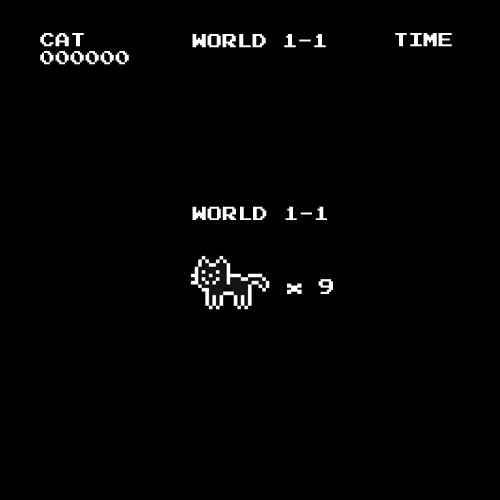

<!-- Monochrome Hero Banner -->

  

### Hey there! 👋

I'm **Hana**, an active software engineer and QA engineer based in the Philippines.

I build practical, user-first web apps that serve as solutions to my own problems. I love blending **AI features** and automation into my life and the work that I do as well.

Lately, I've been building with **TypeScript + React/Vite**, **Python (FastAPI/Streamlit)**, and **Node/Express**.

Currently, I'm shipping personal projects around productivity while finishing my final year in Information Technology at **Cebu Institute of Technology - University**.

---

### Stuff That I Worked On

- [studytrail](https://github.com/alkaseltzerrr/studytrail): 🧭 Personalized AI-powered study planner that generates weekly plans from deadlines, priorities, and study preferences.
- [SonicInsight](https://github.com/alkaseltzerrr/SonicInsight): 🎧 AI music lab for album analysis, lyric generation, similarity search, genre prediction, and mood-based playlist curation.
- [KumaTime](https://github.com/alkaseltzerrr/KumaTime): ⏱️ Pomodoro productivity app with a virtual buddy, streak tracking, and gamified focus sessions.
- [shuken-apuri](https://github.com/alkaseltzerrr/shuken-apuri): 🗂️ Kawaii flashcard app with study modes, fuzzy answer checking, and Leitner-style spaced repetition.
- [renshuu-notesapp](https://github.com/alkaseltzerrr/renshuu-notesapp): 📝 react practice.

---

#### Fun Facts:
- 🦄 I love unicorns.
- 💻 I'm flexible with any IT tech stack, but I prefer front-end development.
- 🧪 I enjoy turning random ideas into small experiments, then evolving the good ones into real projects.
- ⚡ I can talk for hours about AI-driven apps, UX details, and shipping fast without sacrificing quality.

---

  

